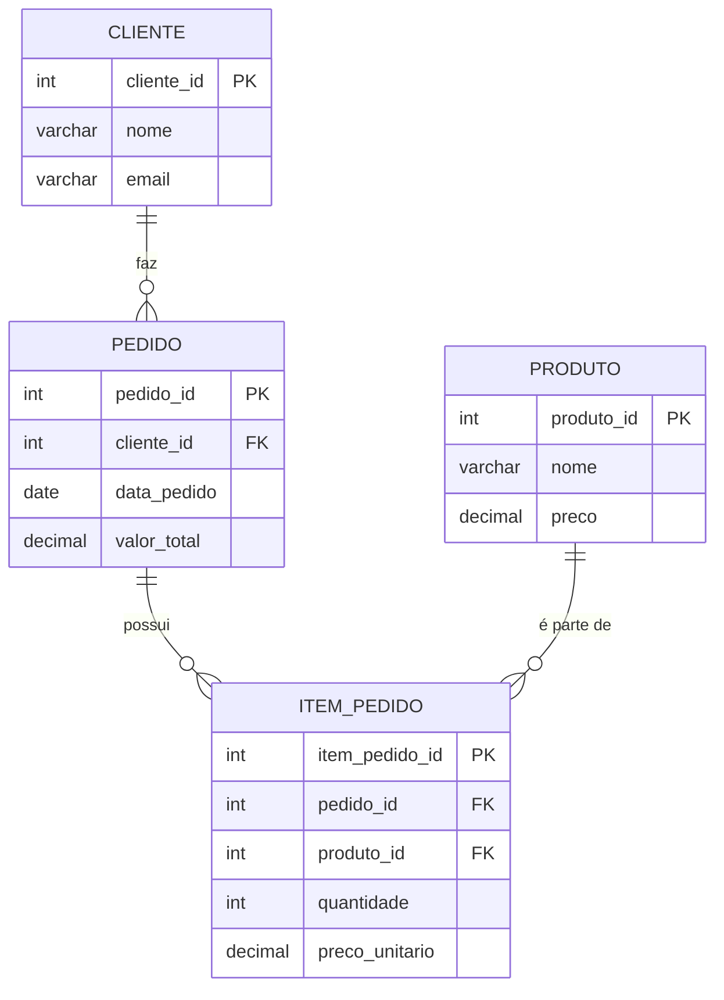

# ⚔️ The Witcher DB ⚔️


Um projeto de banco de dados relacional inspirado no universo de **The Witcher**, criado para demonstrar de forma prática conceitos essenciais de modelagem de dados e automação.

---

## 📜 Tabela de Conteúdos

- [Sobre o Projeto](#-sobre-o-projeto)
- [Tecnologias Utilizadas](#-tecnologias-utilizadas)
- [Estrutura do Repositório](#-estrutura-do-repositório)
- [Como Começar](#-como-começar)
- [Modelo de Dados e Normalização](#-modelo-de-dados-e-normalização)
- [Próximos Passos](#-próximos-passos)
- [Como Contribuir](#-como-contribuir)

---

## 🎯 Sobre o Projeto

O objetivo do **Witcher DB** é servir como um exemplo claro e funcional de um banco de dados bem estruturado. Ele implementa um pequeno cenário do mundo de The Witcher, onde clientes (cidadãos) criam contratos (pedidos) para que bruxos lidem com monstros (produtos).

Este projeto demonstra:
*   ✅ Modelagem Lógica em **Terceira Forma Normal (3NF)**.
*   ✅ Uso correto de **Chaves Primárias e Estrangeiras** para garantir a integridade relacional.
*   ✅ Implementação de **Regras de Negócio** através de `TRIGGERS` e `FUNCTIONS` para cálculos automáticos.
*   ✅ Scripts SQL para criação de schema (`DDL`) e manipulação de dados (`DML`).

---

## 🛠️ Tecnologias Utilizadas

*   **PostgreSQL (v13+):** O Sistema de Gerenciamento de Banco de Dados principal.
*   **SQL:** A linguagem padrão para definição e manipulação dos dados.
*   **Git:** Para controle de versão.

> **Nota sobre MySQL:** O script `schema.sql` pode ser adaptado para MySQL 8+ com pequenas alterações, como substituir `SERIAL` por `AUTO_INCREMENT` e ajustar a sintaxe da trigger para o SQL procedural do MySQL.

---

## 📁 Estrutura do Repositório

---

## 🚀 Como Começar

Siga os passos abaixo para configurar e executar o projeto em seu ambiente local.

### 1. Pré-requisitos
Certifique-se de ter o **PostgreSQL** e o cliente de linha de comando **psql** instalados em sua máquina.

### 2. Clone o Repositório
Para obter uma cópia local do projeto, abra seu terminal e execute o seguinte comando:
```bash
git clone https://github.com/weritonpetreca/witcher_db.git
```

### 3. Crie o Banco de Dados e Carregue o Schema
Execute os seguintes comandos no seu terminal:
*Substitua `seu_usuario` pelo seu nome de usuário do PostgreSQL.*

```bash
psql -U seu_usuario
``` 
-- No prompt do PostgreSQL, crie o banco de dados:
```
CREATE DATABASE witcher;
\q
```
Impoerte o schema para criar as tabelas e as regras de negócio:
```bash
psql -U seu_usuario -d witcher -f schema.sql
```

### 4. Popule com Dados de Demonstração
Para ver o banco em ação, execute o script de demonstração que insere dados e realiza uma consulta de exemplo.
```bash
psql -U seu_usuario -d witcher -f script_demo.sql
```
Ao final, você verá o pedido `pedido_id = 1` com o campo `valor_total` preenchido automaticamente com `450.00` pela trigger, confirmando que a automação está funcionando!

---

## 📊 Modelo de Dados e Normalização

O modelo foi projetado seguindo as três primeiras formas normais para evitar redundância e garantir a consistência dos dados.

| Entidade | Papel no Universo Witcher | Tabela Correspondente |
|:---|:---|:---|
| **Cliente** | Habitantes que solicitam contratos de bruxos | `cliente` |
| **Produto** | Monstros a serem caçados ou itens mágicos | `produto` |
| **Pedido** | O contrato formal entre um cliente e um bruxo | `pedido` |
| **Item_Pedido**| Detalhes específicos de um contrato (ex: 1 Grifo) | `item_pedido` |


---

## 🗺️ Próximos Passos

O projeto pode ser expandido com as seguintes funcionalidades:

- [ ] **Otimização:** Criar índices em chaves estrangeiras (`FKs`) para acelerar consultas com `JOINs`.
- [ ] **Auditoria:** Adicionar triggers para registrar o histórico de alterações em tabelas críticas.
- [ ] **API Layer:** Desenvolver uma API REST (em Node.js, Python, Java, etc.) para interagir com o banco de dados.
- [ ] **Testes:** Criar scripts de teste de integração para simular cenários complexos e inserções em massa.

---

## 🙌 Como Contribuir

Contribuições são o que tornam a comunidade de código aberto um lugar incrível para aprender e criar. Qualquer contribuição que você fizer será **muito bem-vinda**.

1.  Faça um **Fork** do projeto.
2.  Crie uma **Branch** para sua feature (`git checkout -b feature/AmazingFeature`).
3.  Faça o **Commit** de suas alterações (`git commit -m 'Add some AmazingFeature'`).
4.  Faça o **Push** para a Branch (`git push origin feature/AmazingFeature`).
5.  Abra um **Pull Request**.

---

> ## _“Toss a coin to your DBA!”_